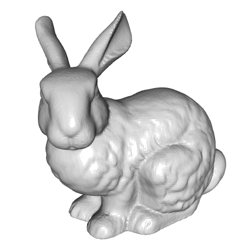
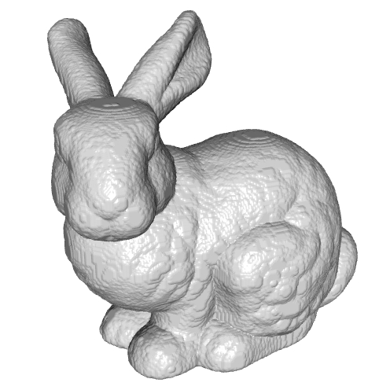

<h2>Euclidean Distance Transform (Version 1.00)</h2>

<a href="#LINKS">links</a>
<a href="#EXECUTABLES">executables</a>
<a href="#USAGE">usage</a>
<a href="#CHANGES">changes</a>

This software supports the computation of the Euclidean Distance Transform (EDT). Supported applications include:
<UL>
<LI>computation of the signed EDT of a volume represented by a voxel grid, using the method of [Saito and Toriwaki, 1994],
<LI>computation of the unsigned EDT of a polygon mesh, using the methods of [Saito and Toriwaki, 1994] and [Danielsson, 1990],
<LI>iso-surface extraction using marching cubes (and variants).
</LI>
</UL>

<a name="LINKS"><b>LINKS</b></a> 
<ul>
<b>Papers:</b>
<a href="https://www.sciencedirect.com/science/article/abs/pii/0146664X80900544">[Danielsson, 1990]</a>,
<a href="https://www.sciencedirect.com/science/article/abs/pii/0031320394901333">[Saito and Toriwaki, 1994]</a>
<a href="https://dl.acm.org/doi/10.1145/37401.37422">[Lorensen and Cline, 1987]</a>
<a href="http://www.cs.jhu.edu/~misha/MyPapers/3DV15.pdf">[Fuhrmann <i> et al.</i>, 2015]</a>
 
<b>Executables: </b>
<a href="http://www.cs.jhu.edu/~misha/Code/EDT/EDT.x64.zip">Win64</a> 
<b>Source Code:</b>
<a href="http://www.cs.jhu.edu/~misha/Code/EDT/EDT.Source.zip">ZIP</a> <a href="https://github.com/mkazhdan/EDT">GitHub</a> 
<!--
<B>Data:</B>
<A HREF="http://www.cs.jhu.edu/~misha/Code/TextureSignalProcessing/EDT.Data.zip">ZIP</A> 
-->
<!--
<b>Older Versions:</b>
<a href="http://www.cs.jhu.edu/~misha/Code/TextureSignalProcessing/Version2.00/">V2</a>, <a href="http://www.cs.jhu.edu/~misha/Code/TextureSignalProcessing/Version1.00/">V1</a>
-->
</ul>

<a name="EXECUTABLES"><b>EXECUTABLES</b></a> 

<ul>
<dl>

<b>EDTFromMesh</b>:
Computes the unsigned EDT from a triangle mesh and outputs a regular grid of dimension 2<i>d</i>&times;2<i>d</i>&times;2<i>d</i> sampling the distance values. 

<dt><b>--in</b> &lt;<i>input mesh</i>&gt;</dt>
<dd> This strings specifies the the names of the mesh. 
The input mesh is assumed to be in <a href="http://www.cc.gatech.edu/projects/large_models/ply.html">PLY</a> format, giving the set of vertices with the x-, y-, and z-coordinates of the positions encoded by the properties <i>x</i>, <i>y</i>, and <i>z</i>. 
</dd>

<dt>[<b>--out</b> &lt;<i>output unsigned EDT</i>&gt;]</dt>
<dd> This string is the name of the file to which the unsigned EDT is written. In addition to the values of the EDT (represented as single-precision floats, describing the distance to the surface in voxel units) the file also stores the similarity transformation mapping grid coordinates to model coordinates.</B>
</dd>

<dt>[<b>--depth</b> &lt;<i>depth of the grid</i>&gt;]</dt>
<dd> This integer specifies the depth of the grid used to sample the unsigned EDT. If the value of this parameter is <i>d</i>, the grid will have resolution 2<i>d</i>&times;2<i>d</i>&times;2<i>d</i>. 
The default value for this parameter is 8.
</dd>

<dt>[<b>--scale</b> &lt;<i>bounding box scale</i>&gt;]</dt>
<dd> This floating point values specifies the scaling of the bounding cube defining the domain over which the EDT is sampled. 
The default value for this parameter is 2.
</dd>

<dt>[<b>--radius</b> &lt;<i>neighbor radius</i>&gt;]</dt>
<dd> This integer values specifies the radius over which exact distances are computed. If the value is non-negative then the more precise method of Danielsson is used, with this value prescribing the radius for exact distance computation. Otherwise, the less precise (but more efficient) method of Saito and Toriwaki is used. 
The default value for this parameter is -1.
</dd>

</dl>
</ul>

<ul>
<dl>

<b>EDTFromGrid</b>:
Computes the signed EDT from a voxel mask and outputs a regular grid of dimension 2<i>d</i>&times;2<i>d</i>&times;2<i>d</i> with the distance values. For this implementation, the mask is represented by a set of color images (all of the same resolution) and a color specifiying the interior label. The output distance function will have negative values for points inside the labelled region and positive value for points outside of it.

<dt><b>--in</b> &lt;<i>input image list</i>&gt;</dt>
<dd> This string is the name of the file listing the images in the stack. 
The images can be in <I>bmp</I>, <I>png</I>, <I>jpg</I>, or <I>jpeg</I> format. The use of JPEG format is discouraged due to the lossy compression.
</dd>

<dt><b>--id</b> &lt;<i>mask red</i>&gt; &lt;<i>mask green</i>&gt; &lt;<i>mask blue</i>&gt;</dt>
<dd> This triplet of integer values values specifies the color that is used to define the interior of the mask.
</dd>

<dt>[<b>--out</b> &lt;<i>output signed EDT</i>&gt;]</dt>
<dd> This string is the name of the file to which the signed EDT is written. In addition to the values of the EDT (represented as single-precision floats) the file also stores the similarity transformation mapping grid coordinates to model coordinates.</B>
</dd>

</dl>
</ul>

<ul>
<dl>

<b>MarchingCubes</b>:
Computes the level-set of an implicit function represented by its discrete samples over a regular grid using the Marching Cubes algorithm of Lorensen and Cline.

<dt><b>--in</b> &lt;<i>input grid</i>&gt;</dt>
<dd> This string is the name of the regular grid sampling the implicit function.
</dd>

<dt><b>--value</b> &lt;<i>iso-value</i>&gt;</dt>
<dd> This floating point value specifies the iso-value used for surface extraction. 
The default value for this parameter is 0.
</dd>

<dt>[<b>--out</b> &lt;<i>output surface</i>&gt;]</dt>
<dd> This string is the name of the file to which extracted surface will be written. The surface will be written out in <a href="http://www.cc.gatech.edu/projects/large_models/ply.html">PLY</a></B> format.
</dd>

<dt>[<b>--fit</b> &lt;<i>interpolation type</i>&gt;]</dt>
<dd> This integer value specifies the way in which a 1D polynomial is fit to a grid edge.
<UL>
<LI>0: a linear polynomial interpolating the values at the two end-points is used.
<LI>1: a quadratic polynomial interpolating the values at the two end-points and providing a least-squares fit to the derivatives at the two end-points is used.
<LI>2: a cubic polynomial interpolating the values at the two end-points and the two neighbors is used.
<LI>3: a (cubic) Catmull-Rom spline fit to the two end-points and the two-neighbors is used.
</UL>
The default value for this parameter is 0.
</dd>

<dt>[<b>--polygons</B>]</dt>
<dd> If this flag is specified, a polygon mesh is extracted. Otherwise the polygons are triangulated (using a minimum area triangulation) and a triangle mesh is returned.
</dd>

</dl>
</ul>

<a name="USAGE"><b>USAGE EXAMPLES (WITH SAMPLE DATA)</b></a> 

<ul>

<dl>

<b>EDTFromMesh/MarchingCubes</b>

To run this executable you must specify the input mesh and the output voxel grid:
<blockquote><code>% Bin/*/EDTFromMesh --in <A HREF="http://www.cs.jhu.edu/~misha/Code/EDT/bunny.ply">bunny.ply</A> --out bunny.saito.edt --depth 9 </code></blockquote>
This generates a 512&times;512&times;512 voxel grid file of unsigned EDT values using Saito and Toriwaki's method. Using a non-negative radius:
<blockquote><code>% Bin/*/EDTFromMesh --in <A HREF="http://www.cs.jhu.edu/~misha/Code/EDT/bunny.ply">bunny.ply</A> --out bunny.danielsson.edt --depth 9 --radius 1</code></blockquote>
generates a 512&times;512&times;512 voxel grid file of unsigned EDT values using Danielsson's method. 
You can then extract the iso-surface at a distance of 5 voxel by calling:
<blockquote><code>% Bin/*/MarchingCubes --in bunny.saito.edt --out bunny.saito.ply --value 5</code></blockquote>
<blockquote><code>% Bin/*/MarchingCubes --in bunny.danielsson.edt --out bunny.danielsson.ply --value 5</code></blockquote>
The figure below shows a visualization of the input mesh (left) the iso-surface extracted from the EDT computed using Saito and Toriwaki's method (middle) and the iso-surface extracted from the EDT computed using Danielsson's method.
<TABLE BORDER=1>
<TR>
	<TD>
	<TD>
	<TD>
</TR>
<TR>
	<TH ALIGN="CENTER">Input
	<TH ALIGN="CENTER">Saito and Toriwaki's EDT
	<TH ALIGN="CENTER">Danielsson's EDT
</TR>
</TABLE>

</dl>

</ul>

<a name="CHANGES"><b>HISTORY OF CHANGES</b></a> 

<!--
<a href="http://www.cs.jhu.edu/~misha/Code/TextureSignalProcessing/Version2.00/">Version 2</a>:
<ul><li> Added support for reaction-diffusion based on the Gray-Scott model.</li></ul>
<a href="http://www.cs.jhu.edu/~misha/Code/TextureSignalProcessing/Version3.00/">Version 3</a>:
<ul><li> Added support for texture stitching.</li></ul>
-->

<a href="http://www.cs.jhu.edu/~misha">HOME</a>
